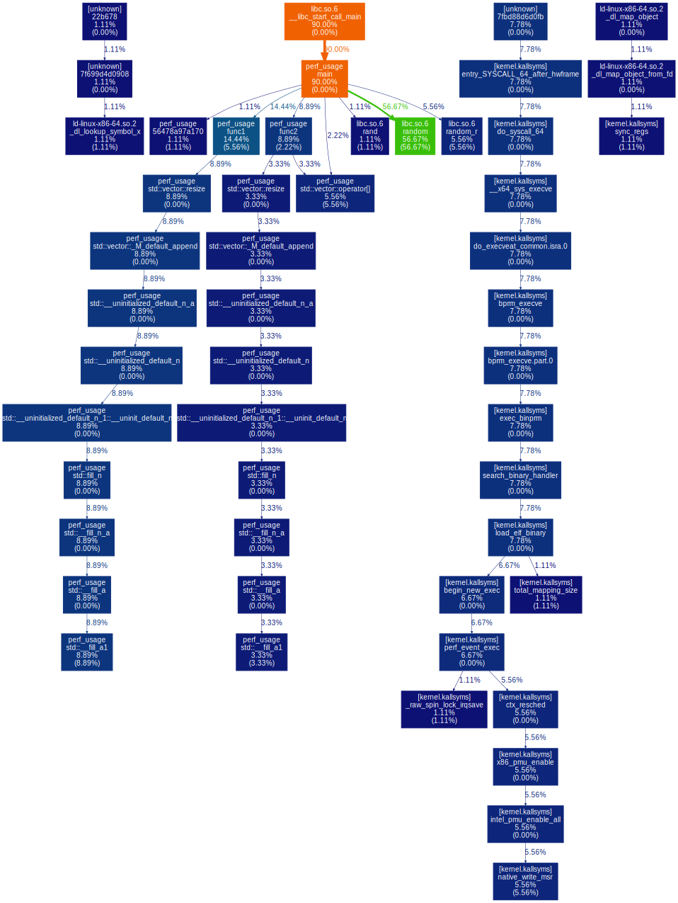
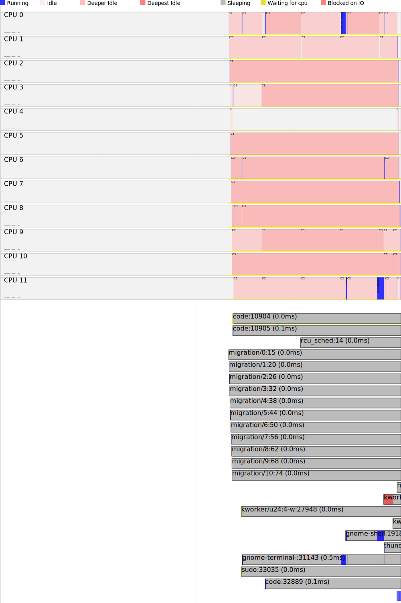

# perf_usage

reference:
[系统级性能分析工具perf的介绍与使用](https://www.cnblogs.com/arnoldlu/p/6241297.html)

## deps install

```
# install perf on ubuntu 22.04
sudo apt update
sudo apt install linux-tools
sudo apt install linux-tools-common
sudo apt install linux-tools-5.15.0-40-generic 
sudo apt install linux-tools-generic
# install graphviz
sudo apt-get install graphviz
# for python3
pip install gprof2dot
```

## cmd

```
cd bin
sudo perf record -g -- ./perf_usage
perf script | c++filt | gprof2dot -s -f perf | dot -Tsvg -o perf_usage_graph.svg
```




```
sudo perf timechart record ./perf_usage
sudo perf timechart
```

